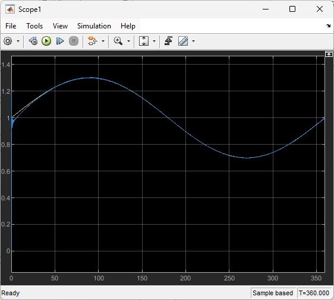
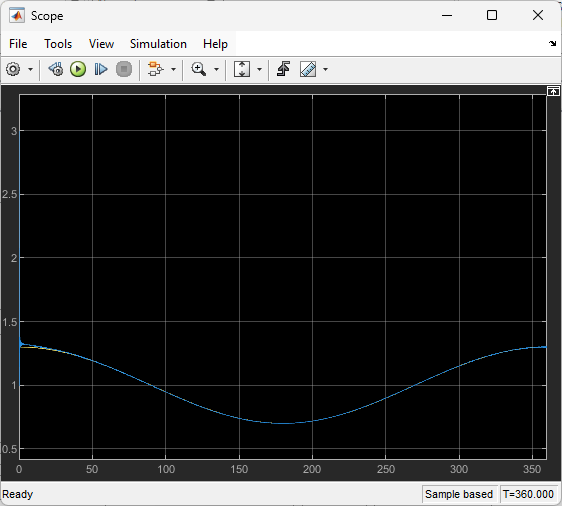
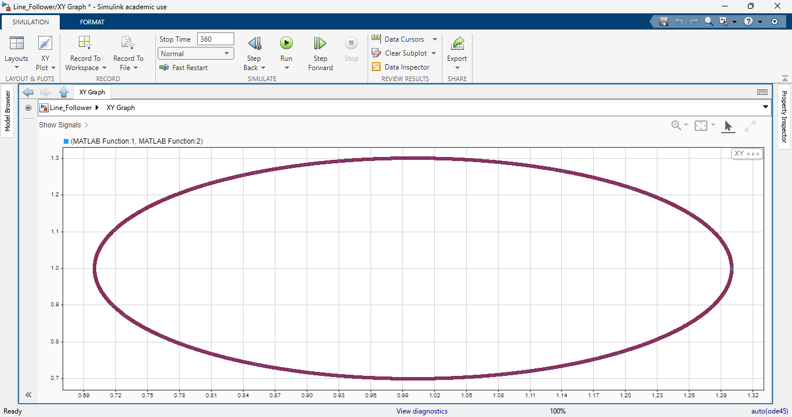

# Robotic-Arm-MATLAB
Control system implementation for a Robotic Arm using SIMULINK
## Project Description
This project focuses on developing a Proportional-Integral-Derivative controller to manage the motion of a simple 2-link robotic arm. The goal is to design a control system that enables the arm to follow predefined trajectories while minimizing overshoot and steady-state errors. The dynamics of the robotic arm are modeled, and simulations are conducted using MATLAB/Simulink to evaluate the controller’s performance, optimizing it for stability and response time.

## Motivation and Social Relevance

PID controllers are extensively used in industries such as automation, manufacturing, and healthcare to achieve precise control of robotic systems. This project contributes to the development of more accurate and responsive robotic arms, enhancing the efficiency and safety of applications ranging from assembly lines to medical robotic systems.

## System Requirements

- **Software**: MATLAB R2023b or later, Simulink toolbox

- **Operating System**: Windows, macOS, or Linux

## Implementation Details

1. **Trajectory Generation**:

A MATLAB Function block in Simulink generates the desired path (e.g., circular or custom trajectories).

Sample code:
```
function [x, y] = fcn(a, b, u)
x = 1 + u * cosd(a);
y = 1 + u * sind(b);
```

2. **Inverse Kinematics**:

A MATLAB function block converts end-effector coordinates (‘x’, ‘y’) to joint angles (‘θ1’, ‘θ2’).

3. **PID Control**:

The PID controller is configured for each joint to minimize the error between the desired and actual joint angles.

The controller parameters (‘Kp’, ‘Ki’, ‘Kd’) are tuned to ensure optimal response time and minimal steady-state error.

4. **System Dynamics**:

The robotic arm’s physical properties, such as inertia and damping, are modeled in a Simulink subsystem.

## Installation and Setup
1. Clone the Repository:
```
git clone https://github.com/Varun-Ajith/Robotic-Arm-MATLAB.git
```
2. Open Simulink Model:

Navigate to the `SimulinkModel` folder and open `Line_Follower.slx`.

3. Run Simulations:

Execute the model to simulate the PID control for trajectory tracking.

## Simulation Results

- Initial simulations show that the PID controller enables the robotic arm to follow circular trajectories with minimal overshoot and steady-state errors.





## Future Work

- Extend the project to include real-time control with hardware.

- Implement adaptive control strategies to handle non-linear dynamics more effectively.

- Explore feedforward control for improved response.

License

This project is licensed under the MIT License. See the [LICENSE](LICENSE) file for more details.


